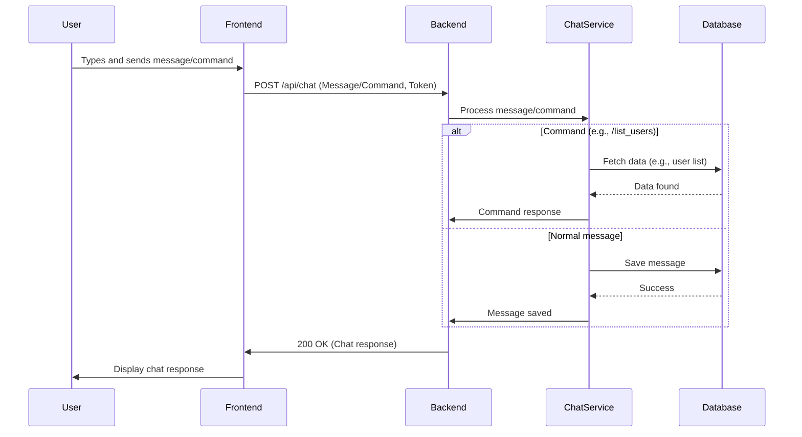

# Furia Chat Bot

[](https://www.oracle.com/java/)
[](https://spring.io/projects/spring-boot)
[](https://angular.io/)

## Overview

A chat bot with simple commands to fetch information about matches, teams, and players related to Furia's CS2 team, allowing queries by name, team tag, region, and match status.

## Key Features

### Match Commands
Query scheduled, completed, and live matches:
- `/ScheduledMatches` - Get upcoming matches
- `/ClosedMatches` - Get completed matches
- `/LiveMatches` - Get matches currently in progress

### Team Commands
Retrieve team-related data:
- `/TagTeam <Team Tag>` - Find team by tag name
- `/NameTeam <Team Name>` - Find team by full name
- `/RegionTeams <Region>` - List teams by region

### Player Commands
Access player information:
- `/NamePlayer <Name>` - Find player by name
- `/TeamPlayers <Team Name>` - List all players on a specific team

### RoadMap Features

- WebScrap to collect real data
- WebSockets to update real time match results
- Improve data models to more details

## Getting Started

### Prerequisites
- Java Development Kit (JDK) 21
- Gradle (dependency management and build)
- Docker (for RabbitMQ containerization)
- PostgreSQL database (H2 is used with dev profile)
- Angular CLI (for frontend)

### Installation

1. Clone the repositories:
   ```bash
   # Backend
   git clone https://github.com/Hyuse98/furia-chat-bot-backend
   
   # Frontend
   git clone https://github.com/Hyuse98/furia-chat-bot-frontend
   ```

2. Environment Variables:
   ```
   JWT_EXPIRATION=3600000
   JWT_SECRET=<your-SHA256-key>
   SPRING_PROFILES_ACTIVE=dev
   ```

### Running the Application

1. Start Backend (Java 21 with Gradle):
   ```bash
   cd backend
   ./gradlew bootRun
   ```

2. Start Frontend (Angular 19):
   ```bash
   cd frontend
   ng serve -o
   ```

## API Usage

The API is consumed by the frontend which listens to `http://localhost:8080/api/chat` for user commands.

### Available Endpoints
All available endpoints can be viewed via OpenAPI Swagger UI: `http://localhost:8080/swagger-ui/index.html`

## Architecture


## Data Flow

### Authentication Flow


### User Interaction Flow


## Technologies

- Java 21 SDK
- Spring Boot 3
- Angular 19
- PostgreSQL
- H2 Database (development)

## Project Structure

```
furia-chat-bot/
  ├── src/
  │   ├── main/
  │   │   ├── java/com/hyuse/chatbot/
  │   │   │   ├── auth/
  │   │   │   ├── chat/
  │   │   │   ├── config/
  │   │   │   ├── exceptions/
  │   │   │   ├── match/
  │   │   │   ├── player/
  │   │   │   ├── team/
  │   │   │   └── FuriaChatBotApplication.java
  │   │   └── resources/
  │   │       ├── db/migration
  │   │       ├── application-prod.yml
  │   │       └── application-dev.yml
  │   └── test/
  └── build.gradle
  
frontend/
    ├── src/
    │   ├── app/
    │   │   ├── auth/
    │   │   │   ├── components/
    │   │   │   ├── guards/
    │   │   │   ├── interceptor/
    │   │   │   ├── models/
    │   │   │   ├── pages/
    │   │   │   └── services/
    │   │   └── pages/
    │   │       ├── chat/
    │   │       └── services/
    │   ├── assets/
    │   └── environments/
    └── angular.json
```

## Security

- JWT-based authentication is implemented
- Tokens expire after 1 hour (configurable via `JWT_EXPIRATION`)
- All API endpoints except login/register require authentication

## Error Handling

The application includes comprehensive error handling:
- Invalid commands return helpful error messages
- Network errors are displayed to the user
- Database connection issues are logged and reported

## Development

### Running in Development Mode
```bash
# Backend with H2 in-memory database
./gradlew bootRun --args='--spring.profiles.active=dev'

# Frontend with auto-reload
ng serve --configuration=development
```

### Running Tests
```bash
# Backend tests
./gradlew test

# Frontend tests
ng test
```

## Deployment

### Building for Production
```bash
# Backend
./gradlew clean build

# Frontend
ng build --configuration=production
```

### Docker Support
A Docker Compose file is available for easy deployment:
```bash
docker-compose up -d
```